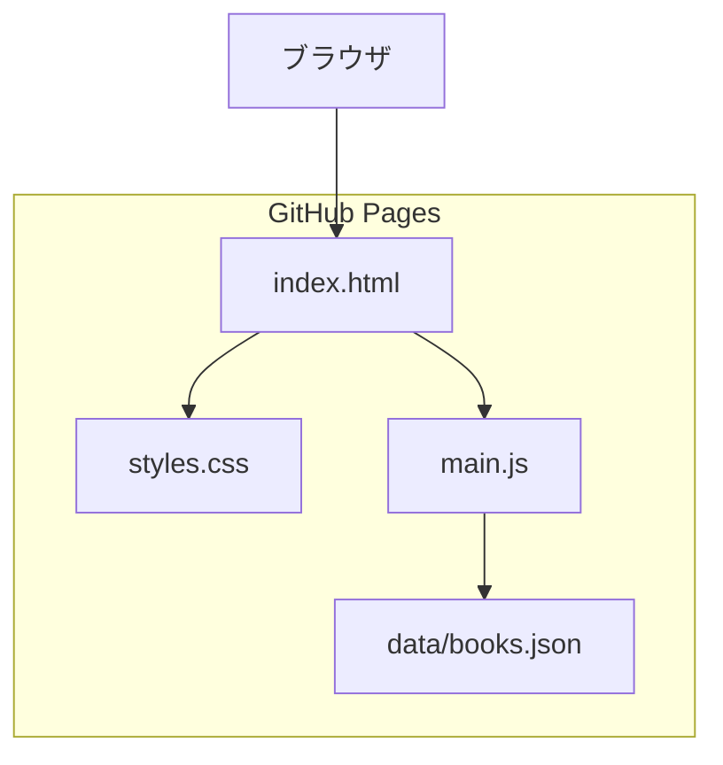
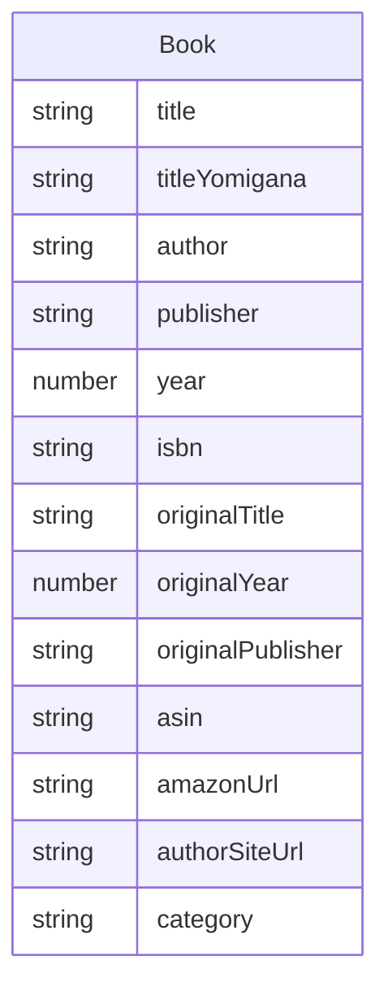

# Design Document

## Overview

**Purpose**: Gerald M. Weinbergの日本語訳書籍一覧を、シンプルなテーブル形式でWeb上に公開する。

**Users**: ワインバーグ著作に関心のある読者が、日本語版と原著の情報を比較・確認するために使用する。

**Impact**: 新規のシングルページ静的サイトを構築する。

### Goals
- 18冊の書籍情報をテーブル形式で一覧表示
- 4列（日本語版タイトル、原著タイトル、日本語版出版年、原著出版年）でソート可能
- GitHub Pagesで追加設定なしにホスト可能

### Non-Goals
- 検索・フィルタ機能
- レスポンシブ対応（将来検討）
- 複数ページ構成
- ビルドツール・バンドラーの使用

## Architecture

### Architecture Pattern & Boundary Map



**Architecture Integration**:
- **Selected pattern**: 静的ファイル構成（HTML/CSS/JS + JSON）
- **Domain boundaries**: 表示（HTML/CSS）、ロジック（JS）、データ（JSON）を分離
- **New components rationale**: シンプルな構成で依存関係なし

### Technology Stack

| Layer | Choice / Version | Role in Feature | Notes |
|-------|------------------|-----------------|-------|
| Frontend | HTML5 / CSS3 / ES6+ | ページ構造・スタイル・ソートロジック | フレームワーク不使用 |
| Data | JSON | 書籍データ管理 | 外部ファイルとして分離 |
| Infrastructure | GitHub Pages | 静的ファイルホスティング | 追加設定不要 |

## Requirements Traceability

| Requirement | Summary | Components | Interfaces |
|-------------|---------|------------|------------|
| 1.1 | HTMLテーブル表示 | BookTable | — |
| 1.2 | 12列の情報表示 | BookTable, BookData | BookDataSchema |
| 1.3 | 出版年昇順の初期表示 | TableSorter | SortConfig |
| 1.4 | 欠損データを「—」表示 | BookTable | — |
| 1.5 | ヨミガナ非表示 | BookData | BookDataSchema |
| 2.1 | 日本語タイトルソート（ヨミガナ） | TableSorter | SortConfig |
| 2.2 | 原著タイトルソート | TableSorter | SortConfig |
| 2.3 | 日本語版出版年ソート | TableSorter | SortConfig |
| 2.4 | 原著出版年ソート | TableSorter | SortConfig |
| 2.5 | 昇順/降順切替 | TableSorter | SortState |
| 3.1 | 静的ファイル構成 | All | — |
| 3.2 | GitHub Pagesデフォルト配信 | All | — |

## Components and Interfaces

| Component | Domain/Layer | Intent | Req Coverage | Key Dependencies | Contracts |
|-----------|--------------|--------|--------------|------------------|-----------|
| BookData | Data | 書籍データの読み込みと提供 | 1.2, 1.5 | JSON file | State |
| BookTable | UI | テーブルのレンダリング | 1.1, 1.2, 1.3, 1.4 | BookData | — |
| TableSorter | Logic | ソート処理の実行 | 2.1-2.5 | BookData | Service |

### Data Layer

#### BookData

| Field | Detail |
|-------|--------|
| Intent | 外部JSONから書籍データを読み込み、アプリケーションに提供 |
| Requirements | 1.2, 1.5 |

**Responsibilities & Constraints**
- JSONファイルからのデータ取得
- データ構造の型保証
- ヨミガナを内部データとして保持（表示には使用しない）

**Dependencies**
- External: data/books.json — 書籍データソース (P0)

**Contracts**: State [x]

##### State Management
```typescript
interface Book {
  // 日本語版情報
  title: string;
  titleYomigana: string;  // ソート用、非表示
  author: string;
  publisher: string;
  year: number;
  isbn: string | null;

  // 原著情報
  originalTitle: string | null;
  originalYear: number | null;
  originalPublisher: string | null;

  // 購入情報
  asin: string | null;
  amazonUrl: string | null;

  // 追加情報
  authorSiteUrl: string | null;  // 著者サイトへのリンク
  category: string | null;        // カテゴリ
}

interface BookDataState {
  books: Book[];
  isLoading: boolean;
  error: string | null;
}
```

### Logic Layer

#### TableSorter

| Field | Detail |
|-------|--------|
| Intent | テーブルデータのソート処理を実行 |
| Requirements | 2.1, 2.2, 2.3, 2.4, 2.5 |

**Responsibilities & Constraints**
- 指定列でのソート実行
- 昇順/降順の状態管理
- 日本語タイトルソート時はヨミガナをキーに使用

**Dependencies**
- Inbound: BookTable — ソート要求 (P0)
- Inbound: BookData — ソート対象データ (P0)

**Contracts**: Service [x]

##### Service Interface
```typescript
type SortColumn = 'title' | 'originalTitle' | 'year' | 'originalYear';
type SortOrder = 'asc' | 'desc';

interface SortState {
  column: SortColumn;
  order: SortOrder;
}

interface TableSorterService {
  sort(books: Book[], column: SortColumn, order: SortOrder): Book[];
  toggleSort(currentState: SortState, column: SortColumn): SortState;
}
```

- **Preconditions**: books配列が存在すること
- **Postconditions**: ソート済みの新しい配列を返す（元配列は変更しない）
- **Invariants**: ソート後もデータの整合性を維持

**Implementation Notes**
- titleソート時は`titleYomigana`フィールドを使用
- 文字列比較には`localeCompare('ja')`を使用
- null値は末尾にソート

### UI Layer

#### BookTable

| Field | Detail |
|-------|--------|
| Intent | 書籍一覧をHTMLテーブルとして描画 |
| Requirements | 1.1, 1.2, 1.3, 1.4 |

**Responsibilities & Constraints**
- テーブルヘッダーとボディのレンダリング
- ソート可能な列のヘッダーにクリックイベント設定
- 欠損データの「—」表示

**Dependencies**
- Inbound: BookData — 表示データ (P0)
- Outbound: TableSorter — ソート処理 (P0)

**Implementation Notes**
- テーブル列（12列）: タイトル | 著者 | 出版社 | 出版年 | ISBN | 原著タイトル | 原著出版年 | 原著出版社 | ASIN | Amazon | 著者サイト | カテゴリ
- ソート可能列のヘッダーにはクリック可能なスタイルを適用
- Amazonリンク・著者サイトリンクは`<a>`タグで表示、URLがない場合は「—」

## Data Models

### Domain Model



**Business Rules & Invariants**:
- `title`と`year`は必須
- `titleYomigana`は必須（ソートに使用）
- その他のフィールドはnull許容

### Logical Data Model

**JSONファイル構造** (`data/books.json`):
```json
{
  "books": [
    {
      "title": "ワインバーグのシステム思考法",
      "titleYomigana": "わいんばーぐのしすてむしこうほう",
      "author": "G.M. Weinberg; 大野 耐一 監修",
      "publisher": "共立出版",
      "year": 1994,
      "isbn": "4-320-02706-X",
      "originalTitle": "Quality Software Management Vol.1",
      "originalYear": 1992,
      "originalPublisher": "Dorset House",
      "asin": "4320027065",
      "amazonUrl": "https://www.amazon.co.jp/dp/4320027065",
      "authorSiteUrl": "https://example.com/book-page",
      "category": "システム思考"
    }
  ]
}
```

## Error Handling

### Error Strategy
- **データ取得失敗**: ユーザーにエラーメッセージを表示し、再読み込みを促す
- **データ欠損**: 該当セルに「—」を表示（正常動作として処理）

### Error Categories and Responses
- **Network Error**: fetch失敗時にエラーメッセージ表示
- **Parse Error**: JSON不正時にエラーメッセージ表示

## Testing Strategy

### Unit Tests
- TableSorterのソート処理（各列、昇順/降順）
- null値を含むデータのソート
- ヨミガナによる日本語タイトルソート

### Integration Tests
- JSONファイル読み込みからテーブル表示まで
- ヘッダークリックによるソート動作

### E2E Tests
- ページ読み込み後のテーブル表示確認
- 各ソート列の動作確認

## File Structure

```
/
├── index.html          # メインHTML
├── css/
│   └── styles.css      # スタイル定義
├── js/
│   └── main.js         # ソートロジック・テーブル描画
└── data/
    └── books.json      # 書籍データ
```
